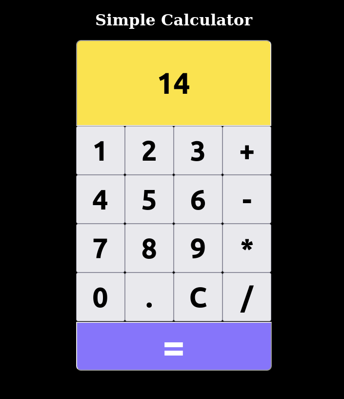
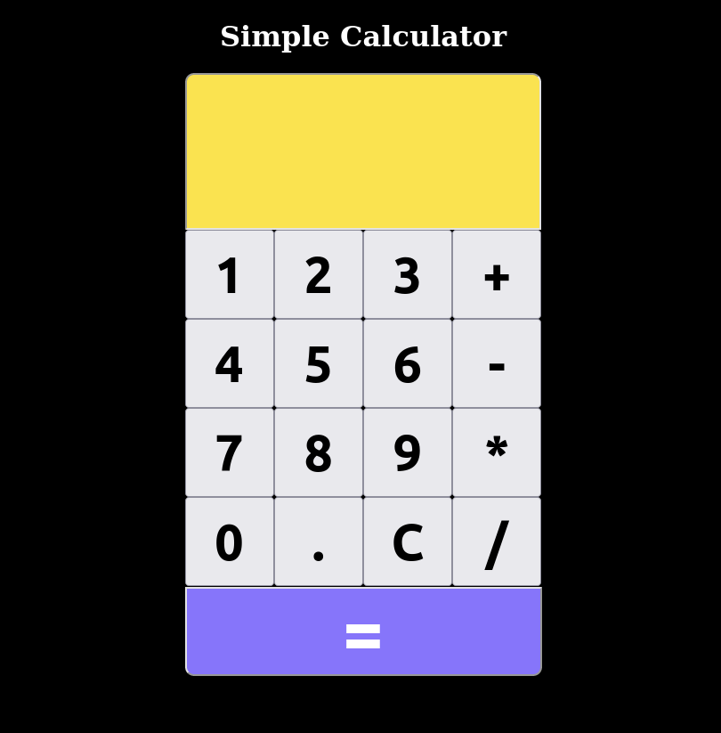
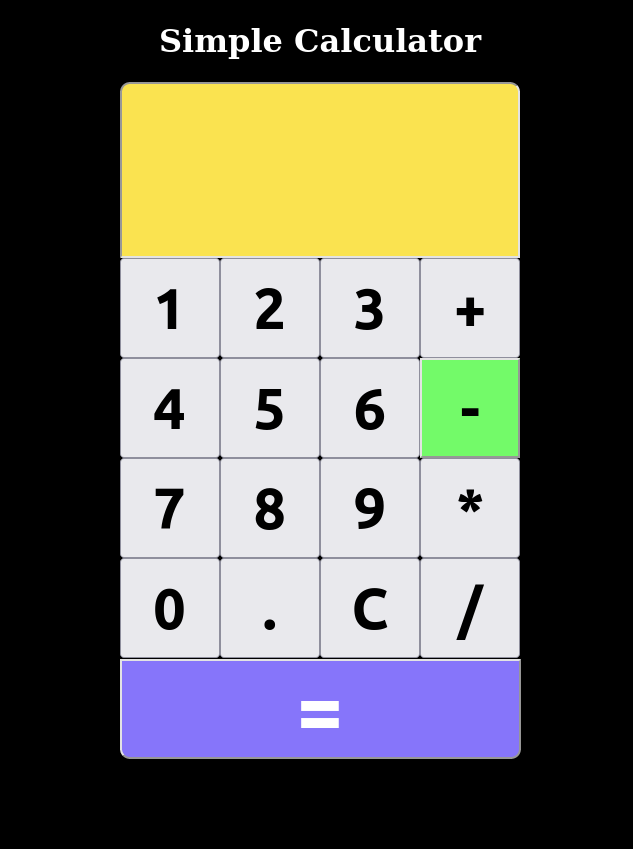

## Índice

- [Visão geral](#visão-geral)
  - [Sobre o Projeto](#sobre-o-projeto)
  - [Imagens](#imagens)
  - [Links](#links)
- [Meu Processo](#meu-processo)
  - [Construído com](#construído-com)
  - [A experiencia](#a-experiencia)
  - [Em futuros projetos](#em-futuros-projetos)
- [Autor](#autor)

## Visão geral

### Sobre o projeto

Nesse projeto foi construído uma calculadora web que faz operações simples de soma, subtração, multiplicação e divisão, que possui botão que apaga os valores na tela e a funcionalidade de destacar a operação atual que esta sendo aplicada. 

### Imagens

### Links
https://simple-calculator-ianfs.vercel.app/

## Meu processo

### Construído com

- Marcação HTML5
- Propriedades CSS
- CSS Gride
- Javascript
- DOM (Document Object Model)

### A experiencia

Nesse projeto eu tive a oportunidade de colocar em pratica conceitos de javascript e css como:

- Reforcei meu conhecimento na Manipulação do DOM utilizando querySelector para manipular elementos do html no javascript.
- Reforcei o aprendizado na utilização do metodo addEventListener para escutar eventos de click no teclado da calculadora.
- Reforcei o apredizado na utilização de condicionais como if, else e switch case pra que fosse possivel calcular de forma correta as operações.
- Aprendi a utilizar CSS Grid layout para configurar a disposição dos botoes no painel.
- Utilizei a propriedade active no css para alterar a cor no momento que o usuario clica no botão para apagar os valores no painel. 

### Em futuros projetos

Pretendo em breve aprimorar esse projeto para que seja possivel fazer calculos complexos como uma calculadora cientifica. 

## Autor

- Website - [Vercel](https://vercel.com/dashboard)
- Linkedin - [@Ian França](https://www.linkedin.com/in/ian-franca/)
- GitHub - [Ian-FS](https://github.com/Ian-FS)